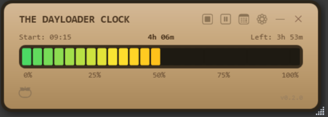

# Dayloader Clock

A Windows desktop app inspired by the **Dayloader Clock** concept by [Matty Benedetto](https://www.youtube.com/@MattBenedetto).
A visual progress bar of your workday that fills up segment by segment with a color gradient (green → yellow → orange → red).

> 🤖 **Coded** with [Claude Opus 4.6](https://www.anthropic.com/) via GitHub Copilot
>
> 🔒 **100% local** — no data is collected, no network calls, everything stays on your machine
>
> Requires Windows 10/11 — .NET 8



## Features

- **Progress bar** with green → yellow → orange → red gradient and blinking last segment
- **Time tracking** — start time, elapsed work time, remaining time, overtime counter
- **Lunch break** automatically excluded from work time
- **Pause / Resume** — freezes the timer (state persists across restarts)
- **End of day** — stops tracking and minimizes to system tray
- **Pomodoro** — focus timer (25 min default) with Windows Do Not Disturb activation
- **Mini mode** — double-click the bar for a compact view (% + remaining time)
- **System tray icon** — mini progress bar in the notification area
- **Taskbar** — progress displayed in the Windows taskbar
- **History** — monthly calendar with hours per day and monthly summary
- **Export** — CSV and Excel (.xlsx)
- **Auto-start** with Windows (optional)
- **Floating window** — always on top, draggable, resizable

## Settings

| Setting | Default |
| --- | --- |
| Work day duration | 8h |
| Lunch break start | 12:00 |
| Lunch break duration | 60 min |
| Pomodoro duration | 25 min |
| Do Not Disturb during Pomodoro | Yes |
| Start with Windows | Yes |

## Installation

Run `DayloaderClock.exe` — no installation required.

Data is stored in `%APPDATA%/DayloaderClock/`.

## Development

```bash
dotnet run                # run in development mode
.\build.ps1               # build a self-contained executable (publish/)
```
